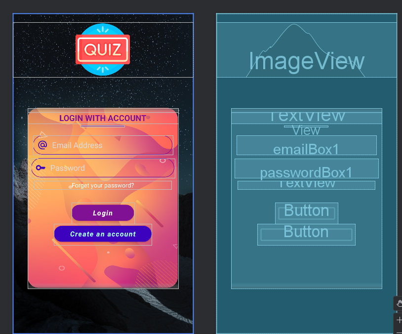
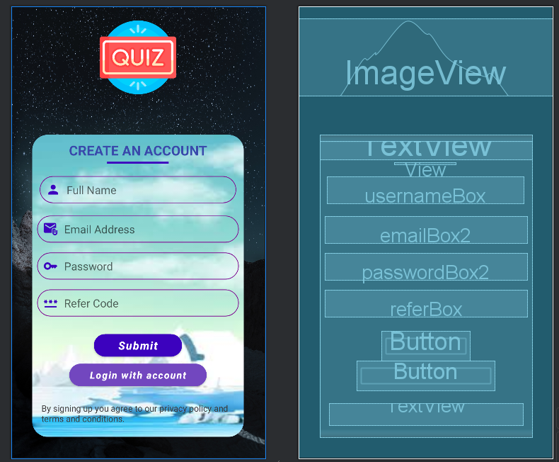

# QuizPal

## Overview

QuizPal is a mobile quiz application designed to provide users with a fun and interactive way to test their knowledge across various topics.

## Goal

The primary goal of QuizPal is to offer an engaging and educational quiz experience, enabling users to challenge themselves, learn new facts, and track their progress over time.

## Features

- Multiple choice questions across different categories and difficulty levels
- Instant feedback on answers after each question
- Score tracking and summary at the end of each quiz
- Randomized questions for a unique experience every time
- User-friendly interface for smooth navigation

### 🔐 Login Page


### 📝 Signup Page


### ❓ Quiz Page

  

## Getting Started

1. **Clone the repository:**
   ```sh
   git clone https://github.com/prasiddha11/QuizPal.git
   ```
2. **Open the project in Android Studio.**
3. **Build the project** to download dependencies and set up the environment.
4. **Run the app** on an emulator or a physical Android device.

*Ensure you have Android Studio and the appropriate SDKs installed.*
