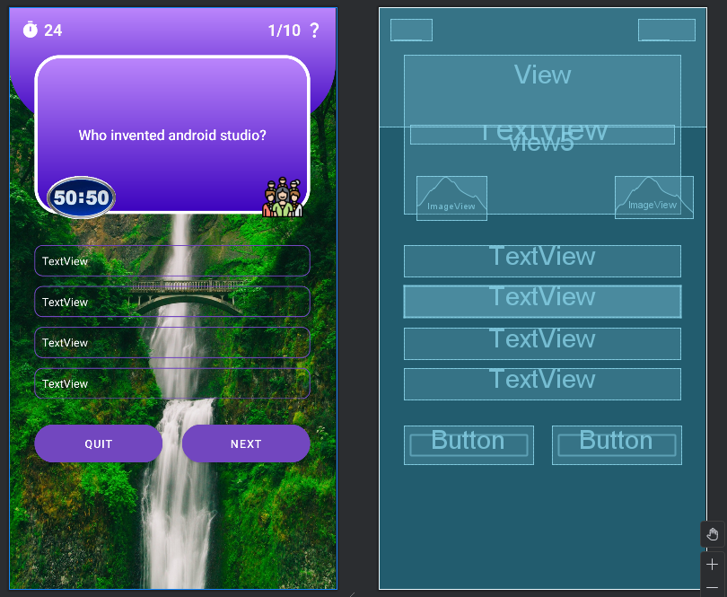

# QuizPal

## 📱 Overview

QuizPal is a mobile quiz application designed to provide users with a fun and interactive way to test their knowledge across various topics.

## 🎯 Goal

The primary goal of QuizPal is to offer an engaging and educational quiz experience, enabling users to challenge themselves, learn new facts, and track their progress over time.

## 🚀 Features

- ✅ Multiple choice questions across various categories and difficulty levels
- ✅ Instant feedback after each question
- ✅ Score tracking and a detailed summary at the end of each quiz
- ✅ Randomized questions for a fresh experience every session
- ✅ Simple and intuitive user interface
- ✅ Lightweight and fast performance
- ✅ Easy to expand with new questions or categories

### 🔐 Login Page


### 📝 Signup Page


### ❓ Quiz Page

  

## Getting Started

1. **Clone the repository:**
   ```sh
   git clone https://github.com/prasiddha11/QuizPal.git
   ```
2. **Open the project in Android Studio.**
3. **Build the project** to download dependencies and set up the environment.
4. **Run the app** on an emulator or a physical Android device.

*Ensure you have Android Studio and the appropriate SDKs installed.*
